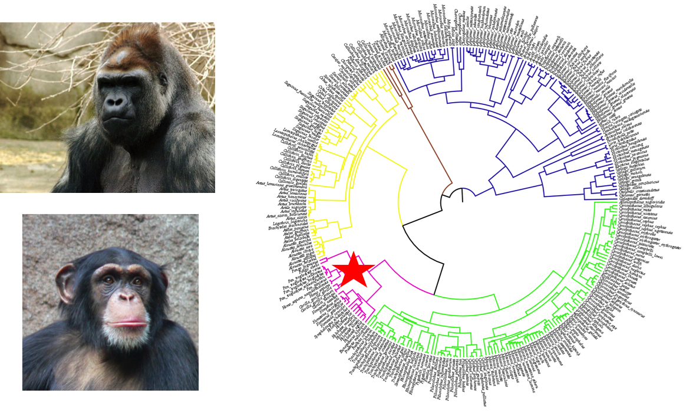
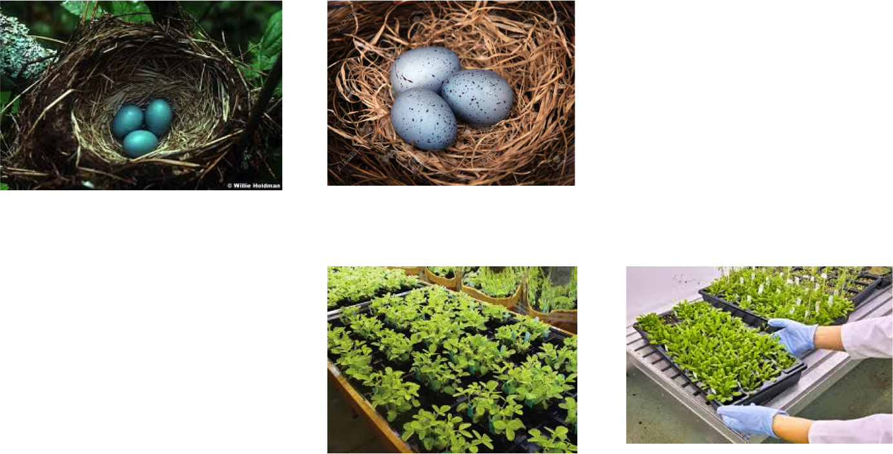
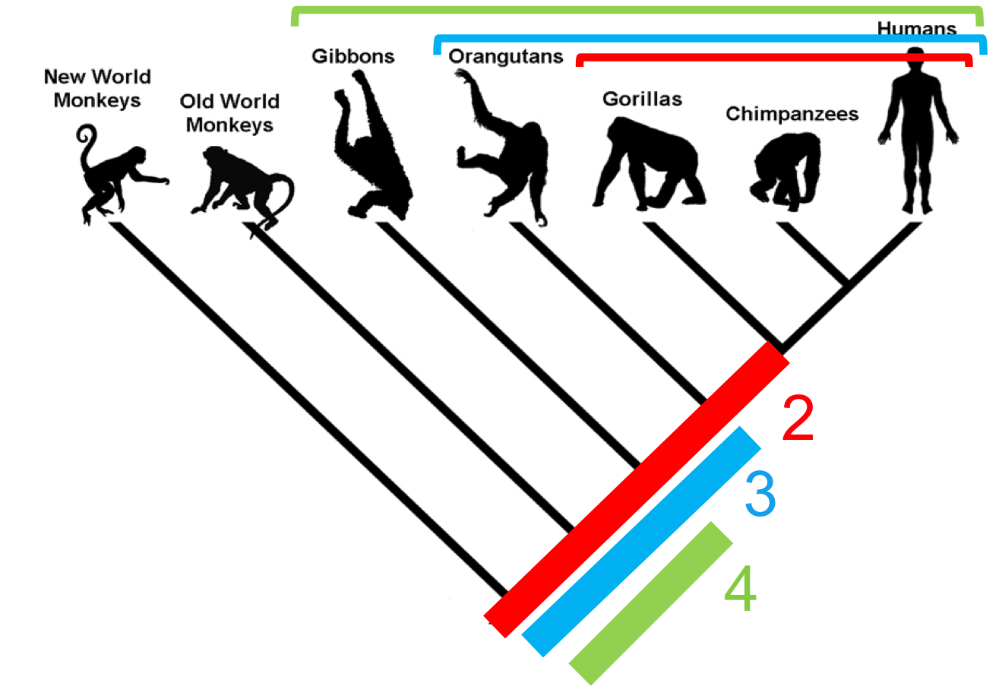

```{r setup, include=FALSE}
knitr::opts_chunk$set(echo = FALSE)
```

# Philosophical approach to answering biological questions

Are large animals more likely to become extinct than small animals?

1. Choose one species (e.g. tiger) and find out everything you can about it, and why it is going extinct.
    + really detailed answer
    + BUT only applies to tigers
    + no replication (N = 1)
    
# Philosophical approach to answering biological questions

Are large animals more likely to become extinct than small animals?

2. Invesigate multiple species and look for correlations among their extinction risk, and their traits.
    + broadly applicable answer
    + BUT lacks detail, ignores outliers

Ideal is probably somewhere in between...

# The comparative method

- Are large animals more likely to become extinct than small animals?
- Are animals with stripes better camouflaged than animals with no stripes?
- Do plants with insect pollinators evolve more quickly than those with bat pollinators?

These are all __comparative__ questions that we can test by comparing different species.

This is the classical way people studied biodiversity - e.g. Darwin, Wallace etc.

# Comparative methods and phylogenies

- Comparative biology is much easier now we have phylogenies
- We can use information about relationships among species to help us answer questions
- Series of methods called Phylogenetic Comparative Methods (PCMs)
- Using a phylogeny and (usually) some other data, to ask questions in ecology and evolution

# What can we do with phylogenies and PCMs?

- Imbalance (why are there more beetles than elephants)
- Rates of diversification
- Tempo and mode of trait evolution
- Phylogenetic niche conservatism
- Zoonotic disease transmission
- Setting conservation priorities
- Phylogenetic non-independence

# Phylogenetic non-independence/pseudoreplication

- probably the most commonly used PCM
- deals with the fact that species are __not independent data points__ in comparative analyses.

# Phylogenetic non-independence/pseudoreplication

- Remember statistical models make assumptions…
- If the assumptions of a model aren't met, then you can't trust the outputs (parameters or p values)

# Phylogenetic non-independence/pseudoreplication

When you fit a linear regression you assume your data points are independent...

```{r, echo = FALSE}
femur.length <- rnorm(50, mean = 100, sd = 25)
height <- femur.length + rnorm(50, mean = 100, sd = 25)
model <- lm(height ~ femur.length)
plot(height ~ femur.length)
abline(model)
```

# Phylogenetic non-independence/pseudoreplication

But if your points are species they are not... instead you find close relatives often cluster together.

```{r, echo = FALSE}
plot(height ~ femur.length)
points(height[femur.length < 60] ~ femur.length[femur.length < 60], col = "deeppink", pch = 16)
points(height[femur.length > 140] ~ femur.length[femur.length > 140], col = "cornflowerblue", pch = 16)
abline(model)
```

# Phylogenetic non-independence/pseudoreplication

- e.g. chimps and gorillas are similar because they share a common ancestot
- these similarities did not evolve independentally

<center></center>

# Phylogenetic non-independence/pseudoreplication
- This is a form of pseudoreplication
- i.e. double counting of the same evidence

<center></center>

# Phylogenetic non-independence/pseudoreplication

If you treat gorillas and chimps as independent, you count all the evolution which occurred on the red branch twice etc.

<center></center>

# How do we deal with this problem?

2 main methods
- Independent contrasts (Felsenstein 1985)
- Phylogenetic Generalised Least Sqaures (PGLS)
- Independent constrasts is just a special case of PGLS where $\lambda$ is equal to 1.

# A quick revision of OLS

- remember residuals?
- OLS minimises these to fit the line (least squares)

```{r, echo = FALSE}
model <- lm(height ~ femur.length)
plot(height ~ femur.length)
abline(model)
res <- signif(residuals(model), 5)
pre <- predict(model) # plot distances between points and the regression line
segments(femur.length, height, femur.length, pre, col="red")
```

# A quick revision of OLS

<center>$Y = X \beta + \epsilon$</center>

<center>$height = femur length \beta + \epsilon$</center>

- $\beta$ = parameters (slope, intercept)
- $\epsilon$ = residual error in the model
    + i.e. variation in heightnot explained by femur length.
    + measurement error, missing variables etc.

# A quick revision of OLS

Residual errors should have a __multivariate normal distribution__ with __variance-covariance matrix__ $\Sigma$

# A quick revision of OLS

Normal distribution (univariate)
- defined by mean ($\mu$) and variance ($\sigma^2$) 

<center></center>

# A quick revision of OLS

Multivariate normal distribution
- defined by mean vector ($\mu$) and variance-covariance matrix ($\Sigma$)
- variance-covariance because with multiple variables you need to know how they are correlated (covariance)

<center></center>


# A quick revision of OLS

Slide 46 
# A quick revision of OLS


