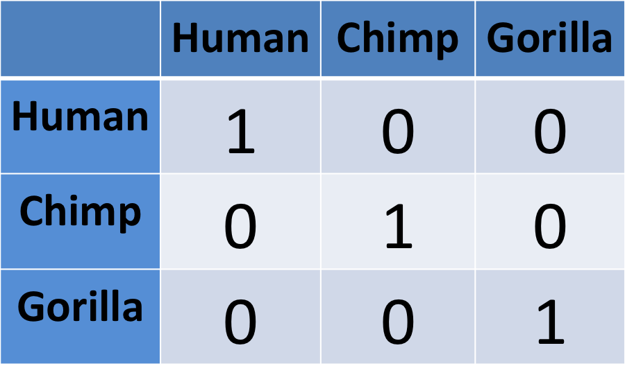
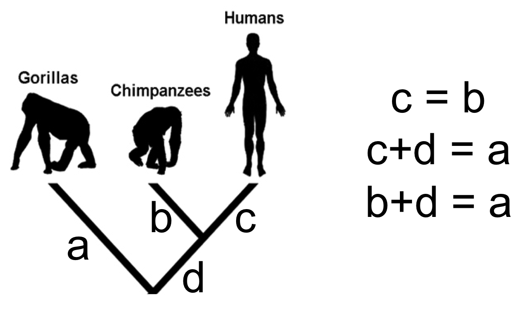
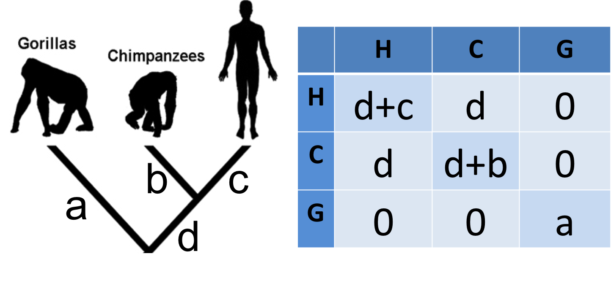
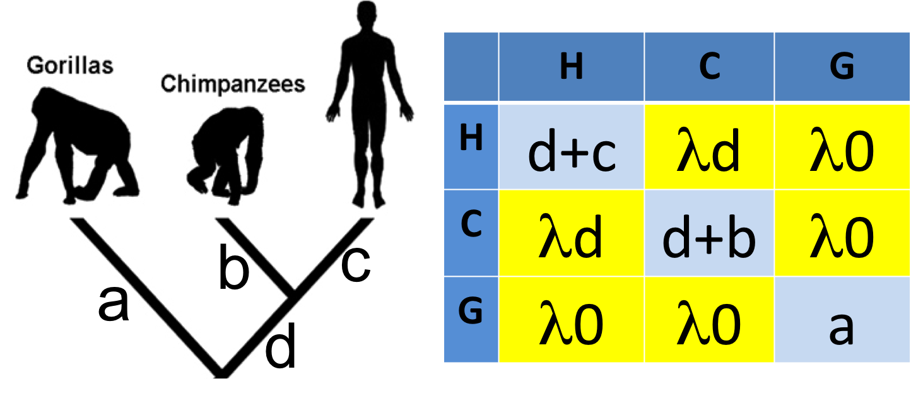
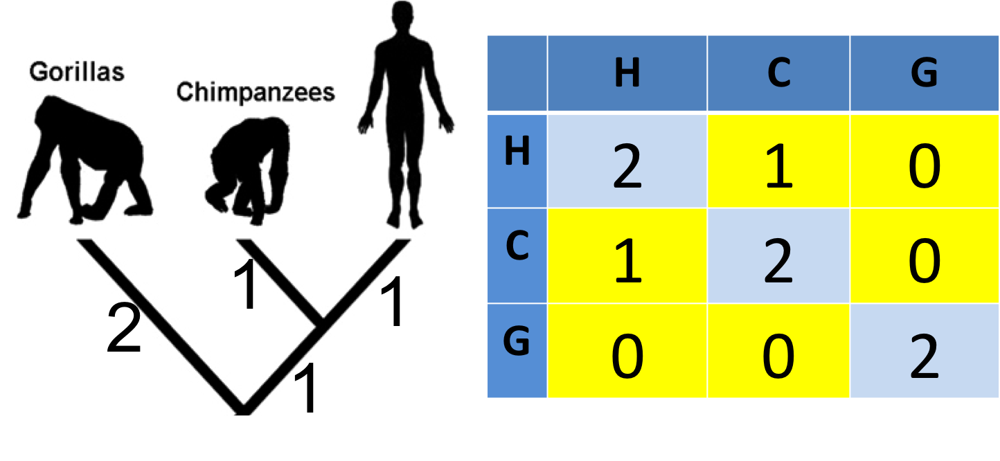
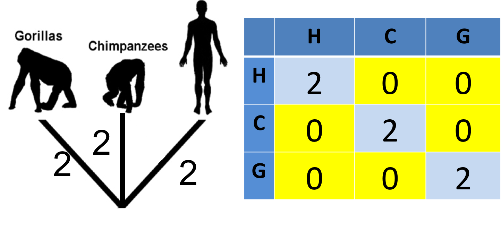
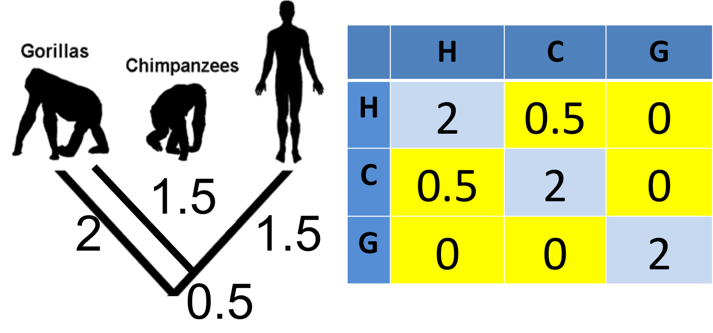
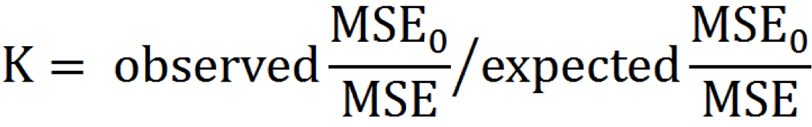
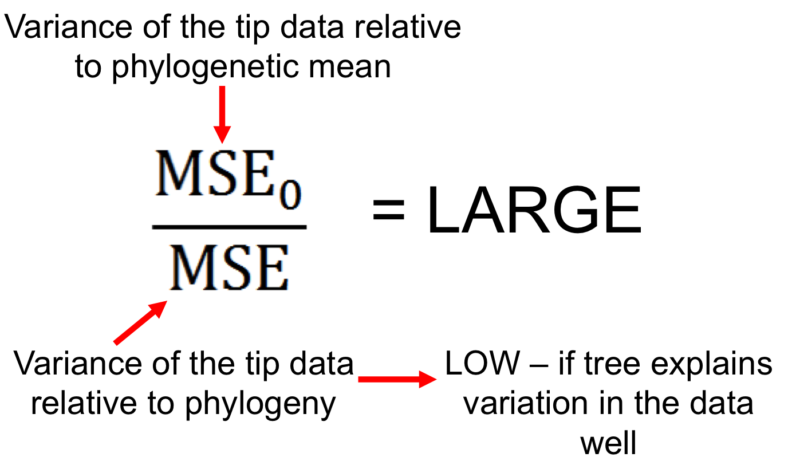
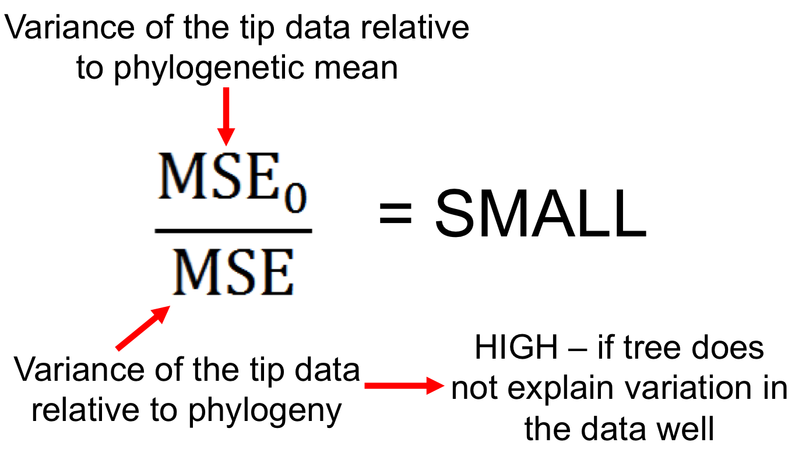

```{r setup, include=FALSE}
knitr::opts_chunk$set(echo = FALSE)
```

# Philosophical approach to answering biological questions

Are large animals more likely to become extinct than small animals?

1. Choose one species (e.g. tiger) and find out everything you can about it, and why it is going extinct.
    + really detailed answer
    + BUT only applies to tigers
    + no replication (N = 1)
    
# Philosophical approach to answering biological questions

Are large animals more likely to become extinct than small animals?

2. Investigate multiple species and look for correlations among their extinction risk and their traits.
    + broadly applicable answer
    + BUT lacks detail, ignores outliers

Ideal is probably somewhere in between...

# The comparative method

- Are large animals more likely to become extinct than small animals?
- Are animals with stripes better camouflaged than animals with no stripes?
- Do plants with insect pollinators evolve more quickly than those with bat pollinators?

These are all __comparative__ questions that we can test by comparing different species.

This is the classical way people studied biodiversity - e.g. Darwin, Wallace etc.

# Comparative methods and phylogenies

- Comparative biology is much easier now we have phylogenies
- We can use information about relationships among species to help us answer questions
- Series of methods called Phylogenetic Comparative Methods (PCMs)
- Using a phylogeny and (usually) some other data, to ask questions in ecology and evolution

# What can we do with phylogenies and PCMs?

- Imbalance (why are there more beetles than elephants)
- Rates of diversification
- Tempo and mode of trait evolution
- Phylogenetic niche conservatism
- Zoonotic disease transmission
- Setting conservation priorities
- __Account for phylogenetic non-independence__

# Phylogenetic non-independence/pseudoreplication

- Remember statistical models make assumptions…
- If the assumptions of a model aren't met, then you can't trust the outputs (parameters or p values)

# Phylogenetic non-independence/pseudoreplication

When you fit a linear regression you assume your data points are independent...

```{r, echo = FALSE, fig.width = 6, fig.height = 2.5}
femur.length <- rnorm(50, mean = 100, sd = 25)
height <- femur.length + rnorm(50, mean = 100, sd = 25)
model <- lm(height ~ femur.length)
par(mar = c(4,4,1,1))
plot(height ~ femur.length)
abline(model)
```

# Phylogenetic non-independence/pseudoreplication

But if your points are species they are not...instead you find close relatives often cluster together.

```{r, echo = FALSE, fig.width = 6, fig.height = 2.5}
par(mar = c(4,4,1,1))
plot(height ~ femur.length)
points(height[femur.length < 60] ~ femur.length[femur.length < 60], col = "deeppink", pch = 16)
points(height[femur.length > 140] ~ femur.length[femur.length > 140], col = "cornflowerblue", pch = 16)
abline(model)
```

# Phylogenetic non-independence/pseudoreplication

- e.g. chimps and gorillas are similar because they share a common ancestor
- these similarities did not evolve independentally

<center></center>

# Phylogenetic non-independence/pseudoreplication
- This is a form of pseudoreplication
- i.e. double counting of the same evidence

<center></center>

# Phylogenetic non-independence/pseudoreplication

If you treat gorillas and chimps as independent, you count all the evolution which occurred on the red branch twice etc.

<center></center>

# How do we deal with this problem?

Two main methods

- Independent contrasts (*Felsenstein 1985*)
- Phylogenetic Generalised Least Squares (PGLS)
- Independent constrasts is just a special case of PGLS where $\lambda$ is equal to 1.

# A quick revision of OLS

- remember residuals?
- OLS minimises these to fit the line (least squares)

```{r, echo = FALSE, fig.width = 6, fig.height = 2.5}
model <- lm(height ~ femur.length)
par(mar = c(4,4,1,1))
plot(height ~ femur.length)
abline(model)
res <- signif(residuals(model), 5)
pre <- predict(model) # plot distances between points and the regression line
segments(femur.length, height, femur.length, pre, col="red")
```

# A quick revision of OLS

<center>$Y = X \beta + \epsilon$</center>

<center>$height = femur length \beta + \epsilon$</center>

- $\beta$ = parameters (slope, intercept)
- $\epsilon$ = residual error in the model
    + i.e. variation in heightnot explained by femur length.
    + measurement error, missing variables etc.

# A quick revision of OLS

Residual errors should have:

- multivariate normal distribution 
- with variance-covariance matrix $\Sigma$

# A quick revision of OLS

Normal distribution (univariate)

- defined by mean ($\mu$) and variance ($\sigma^2$) 

<center></center>

# A quick revision of OLS

Multivariate normal distribution

- defined by mean vector ($\mu$) and variance-covariance matrix ($\Sigma$)

<center></center>


# A quick revision of OLS

- The identity matrix (I) assumes human, chimpanzee and gorilla traits are __independent__
- We know they aren't, so we need to use something other than OLS

<center></center>

# Generalised Least Squares (GLS)

- generalised version of OLS
- i.e. for when identity matrix cannot be used
- same as GLM vs LM
- Can incorporate lots of different types of errors (phylogenetic, spatial etc.)

# Variance-covariance matrices in PGLS

<center></center>

# Variance-covariance matrices in PGLS

- this vcv in PGLS is equivalent to independent contrasts
- independent contrasts is just a special case of PGLS
- assumes differences evolve at equal rates across the tree...

<center></center>

# Tree transforms

- we can transform the tree to make it fit the data better
- PGLS usually uses Pagel's $\lambda$ (*Pagel 1999*)

<center></center>

# Pagel's $\lambda$ 

$\lambda$ transforms the tree by multiplying the off-diagonal elements (internal/shared branches) of the vcv matrix by $\lambda$ 

<center></center>

# Pagel's $\lambda$ = 1

Tree remains the same = trait is evolving under Brownian motion (BM)

__This is the same as independent contrasts__

<center></center>

# Pagel's $\lambda$ = 0
Tree collapses to a star phylogeny = trait is not related to phylogeny

__This is the same as an OLS model__

<center></center>

# Pagel's $\lambda$ = 0.5
Internal branches get shorter = there is phylogenetic signal in the trait but not as much as under BM.

<center></center>

# Pagel's $\lambda$ summary

- Multiplies all branches (except those leading to the tips) by $\lambda$
- Shortens the internal branches relative to the tips
- $\lambda$ = 0: no relationship between trait and phylogeny = star phylogeny
- $\lambda$ = 1: trait values are as expected under Brownian motion = phylogeny is unchanged
- Measure of __phylogenetic signal__

# Phylogenetic signal 

Pattern where related species resemble each other more than more distant relatives

Note this is a pattern not a process (*Kamilar & Cooper 2013*; *Losos 2011*)

# Phylogenetic signal 

Two most used methods are:

1. Pagel's $\lambda$ (*Pagel 1997/99*)
2. Blomberg's *K* (K not kappa) (*Blomberg et al 2003*)

# Blomberg's *K*

<center></center>

- MSE is the mean squared error 
- i.e. the variance in the trait (put very simply)

# Blomberg's *K*

<center></center>

# Blomberg's *K*

<center></center>

# Blomberg's *K*

- $\frac{MSE_0}{MSE}$ is different for every tree as it depends on tree size and shape

- Therefore we divide this by the expected value under Brownian motion so we can compare trees.

<center></center>

# Blomberg's *K*

- $K = 1$ trait values are as expected under BM ($\lambda = 1$)
- $K > 1$ trait values more similar than expected under BM
- $K = 0$ no relationship between phylogeny and trait ($\lambda = 0$)
- Maximum *K* depends on the trait

# Blomberg's *K* summary 

- Ratio of variance in trait relative to phylogenetic mean and variance in trait relative to phylogeny
- $K = 1$ trait values are as expected under BM ($\lambda = 1$)
- $K > 1$ trait values more similar than expected under BM
- $K = 0$ no relationship between phylogeny and trait ($\lambda = 0$)

# Pagel's $\lambda$ versus  Blomberg's *K*

- $\lambda$ ranges from 0 to just over 1 (R forces it to be maximum of 1)
- *K* is more flexible and can be greater than 1, better for showing trait conservatism
- $\lambda$ is good for using in PGLS models
- *K* is perhaps better for measuring phylogenetic signal in individual traits?
- Just use both! 

# Brief caveat!!! 

- We may be interested in the phylogenetic signal in a trait
- e.g. body size (almost always high)
- But high signal in the individual traits doesn't mean we need to account for phylogeny
- it's not the traits, it's the __residuals__ we need to worry about (*Revell 2010*)
- Same as in LM vs GLM, we want normally distributed __residuals__, don't care about the variables themselves...

