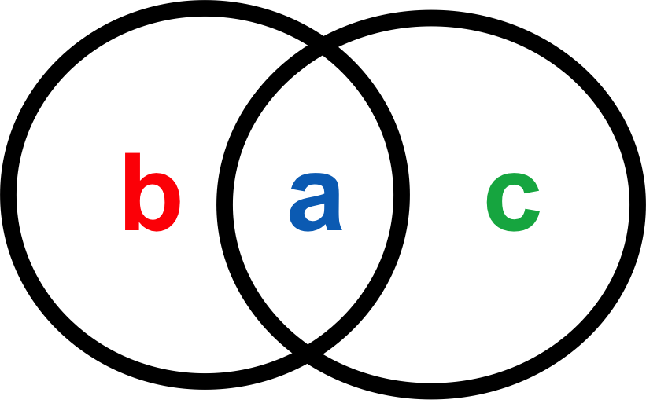

```{r setup, include=FALSE}
knitr::opts_chunk$set(echo = FALSE)
```

# Why use a diversity index?

- why might we want to know how many species are in an area?

[//]: #

# Types of diversity - $\alpha$ diversity

- mean species diversity in sites or habitats at a local scale 
- e.g. how many plant species in the wildlife garden?

# Types of diversity - $\beta$ diversity

- turnover in $\alpha$ diversity among different sites
- how does species diversity change as you move from one site to another
- e.g. how does the number/type of plants change between the the wildlife garden and Hyde Park?

# Types of diversity - $\beta$ diversity

- lots of ways to measure (see *Koleff et al 2003*)
- similarity and dissimilarity metrics
- e.g. Jaccard's index
- $\beta_{jaccard} = \frac{a}{a + b + c}$

<center></center>   

# Types of diversity - $\gamma$ diversity

- diversity at the landscape level
- sum of all $\alpha$ diversity values

# Total numbers versus evenness

- some measures take account of evenness and/or abundance
- can be really important for ecosystem function

# Biodiversity hotspots

- $\alpha$ diversity can be really high in many places
- Hotspots are characterised by high $\beta$ and $\gamma$ diversity
- e.g. UK versus Kenya

# Why use species richness estimators?

- why might counting all the species in an area be unfeasible?

# Species richness estimation

- species accumulation curves
- species richness estimators e.g. Chao 1
- $S_{chao1} = S_{obs} + \frac{{f_1}^2}{2 * f_2}$

# Practical - Diversity Indices in R

- make sure to read the notes carefully
- feel free to discuss with colleagues
- ask if you get stuck or have questions
- take breaks when you like
- Remember to answer the practice questions and SAVE YOUR RESULTS AND CODE.
