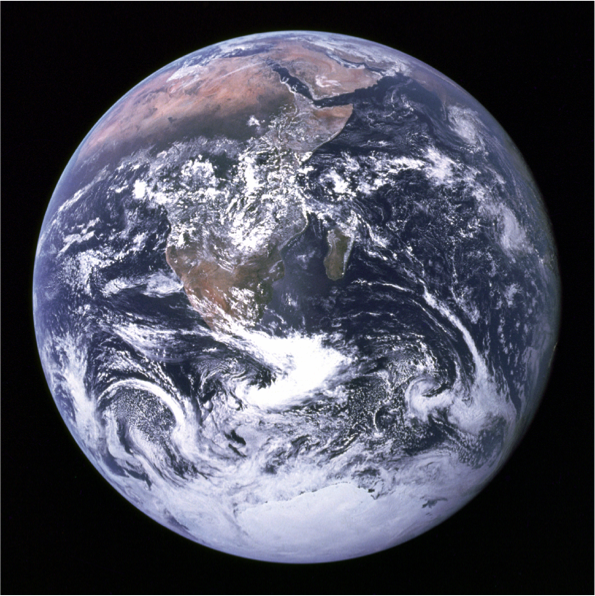
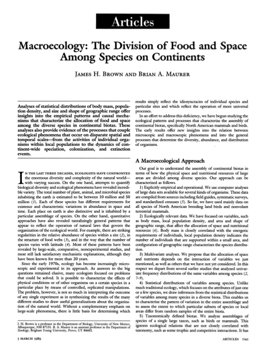
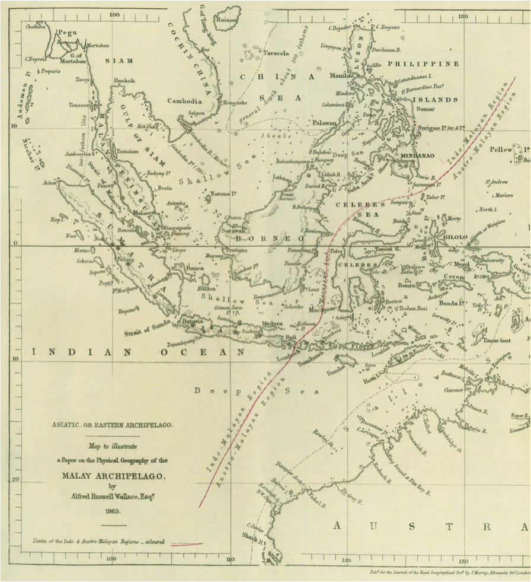
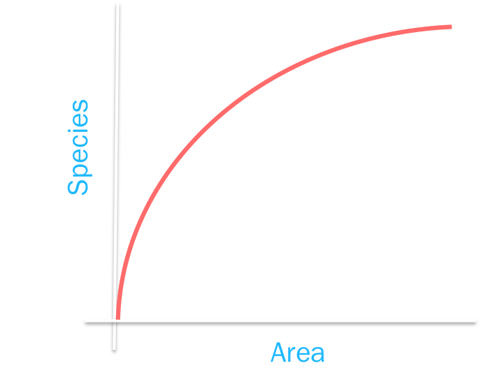
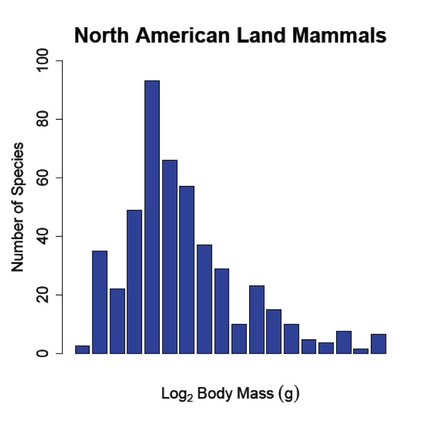
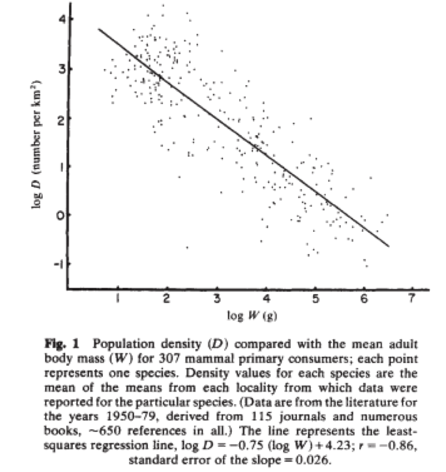
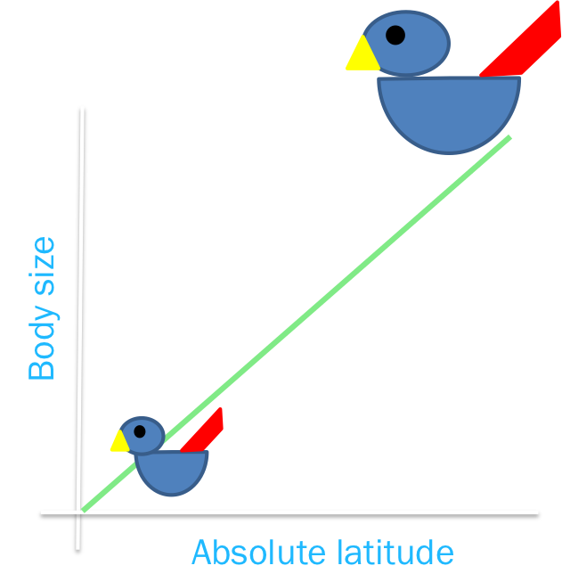
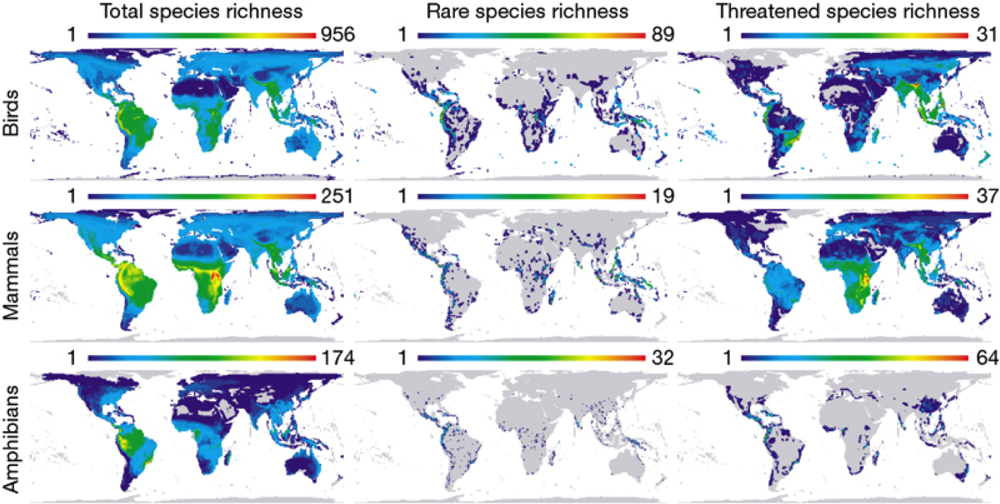
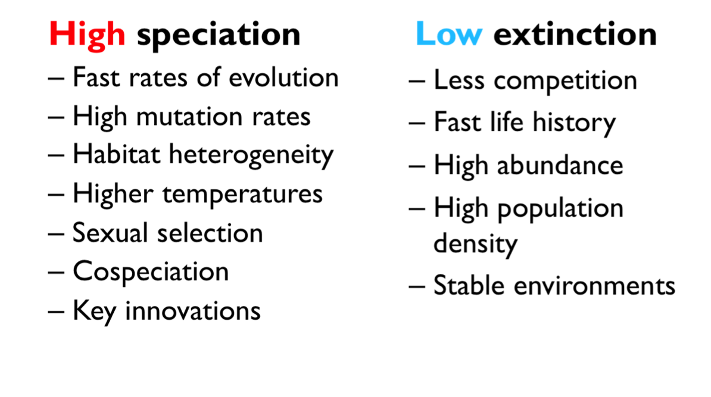
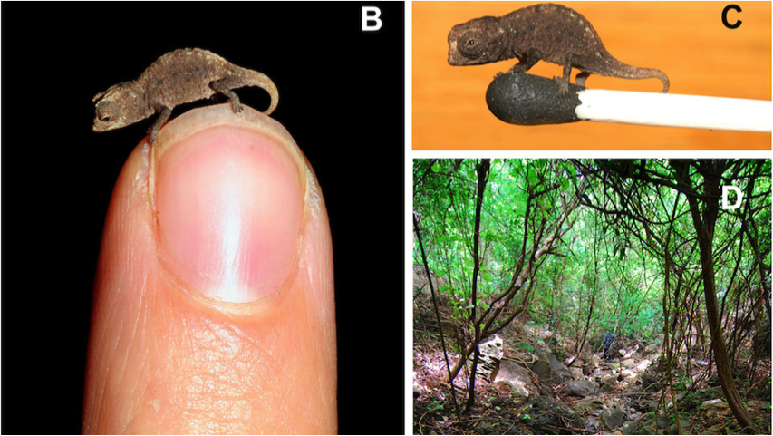

```{r setup, include=FALSE}
knitr::opts_chunk$set(echo = FALSE)
```

# What is macroecology?

### Macroecology is ecology at large spatial scales

# What is macroecology?

<center></center>

[//]: #

# What is macroecology?

### Ecology at large scales

- large spatial scale (explicit) 

- large temporal scale (implicit)
- large numbers of species (broad taxonomic scale)
- no clear definition of what scale defines macro vs. not macro

[//]: #

# Why did macroecology emerge?

- First use of the term is Brown and Maurer 1989 Science


[//]: #

# {.cover}



[//]: #

# Why did macroecology emerge?

- First use of the term is Brown & Maurer 1989 Science

- Experiments have limits
- Scaling from local to global patterns is hard.
- Ecological processes act at various scales.
- "Seeing the forest for the trees" - Gaston & Blackburn 2000
- Data availability (and analysis tools)

[//]: #

# What do we study in macroecology?

- Broad scale ecological patterns and the processes that underlie them
    + geographic range size
    + body size
    + abundance
    + diversity (species richness, functional diversity, phylogenetic diversity)
        
[//]: #

# Species area-relationships

- More area = more species (*Willis 1922*)

- $S = cA^z$ (*Arrhenius 1921*)

[//]: #

# Species area-relationships

- More area = more species (*Willis 1922*)

- $S = cA^z$ (*Arrhenius 1921*)
- $log(S) = z* log(A) + c$


[//]: #

# Species area-relationships

- More area = more species (*Willis 1922*)

- $S = cA^z$ (*Arrhenius 1921*)
- $log(S) = z* log(A) + c$
- $z$ is usually small (0.1-0.5)
- $z$ may depend on many factors
    + type of species involved
    + climate
    + altitude
    + latitude 
    + species interactions

[//]: #

# Body-size diversity relationships

- Right skew at large scales (*Brown & Nicoletto 1991*)

- Normal distribution at small scales
- Mechanisms varied
    + speciation and extinction rates
    + dispersal abilities
    + competition
    + energetic constraints
- *Hutchinson & MacArthur 1959*

[//]: #

# Abundance body-size relationships

- Negative correlation (*Damuth 1981*)

- Large animals have lower abundance
- Mechanisms include species energy hypotheses

[//]: #

# Macroecological "rules"

- Bergmann's rule (*Bergmann 1847*, see reference list)

    + warm-blooded vertebrate species from cooler climates tend to be larger than congeners from warmer climates
    + mechanisms include SA:Volume, energy requirements etc.
    + true for about 70% mammals, 60% birds (*Meiri & Dayan 2003*)

[//]: #

# Macroecological "rules"

- Allen’s "rule" (*Allen 1877*)
    + species have smaller extremities at high absolute latitudes. 
- Rapoport’s "rule" (*Rapoport 1982; Stevens 1989*)
    + species have larger ranges at higher absolute latitudes.
- Gloger’s "rule" (*Gloger 1833*)
    + species are darker coloured nearer the equator.

[//]: #

# Hotspots of biodiversity

- Grenyer et al. 2006

<center></center>   

[//]: #

# Latitudinal diversity gradients

- More species in the tropics than temperate zones.
- True for most species (exceptions include marine mammals, bumblebees, turtles…)
- Mechanism is still unclear...there are hundreds of hypotheses!

[//]: #

# Why are there more species in the tropics?

- Higher diversification rates (high speciation, low extinction)
- Geographical area
- Mid domain effect
- Time for speciation
- Historical perturbation
- Climatic stability
- Species-energy
- Species interactions
- Biases in counting species

# Why is diverification higher in the tropics?

- *Weir & Schluter 2007, Jablonksi et al. 2006, Mittelbach et al. 2007, Schemske 2009*

<center></center>   
# Bias in counting species

- Small species may be missed

- Species in complex habitats may be missed
- Uncharismatic species may be missed (taxonomic bias) (*Isaacs et al. 2004*)

# How do we study macroecology?

- Mapping species distributions
- Biodiversity indices (*Today*)
- Phylogenetic comparative methods (*Monday*, *Tuesday*)
- Large databases e.g. PREDICTS, PBDB (*Friday*)
- Models, simulations etc.
- Increasingly field work

# Modern macroecology

- Big data, big analyses, complex methods
- More applied topics
    + disease macrecology (*Me sometimes*)
    + anthropogenic change (*Friday*, *Andy Purvis*)
    + invasive species
    + climate change 
    + land use change (*Friday*, *Andy Purvis*)
- More focus on mechanisms and models
- Citizen Science (*Angela Marmot Centre*)
- Data availability, sharing, reproducibility

# Interested in learning more?

- Twitter: @BESMacroecol
- Conference @ NHM 5-7th July
- Macro ecology/evolution, paleo and living data

