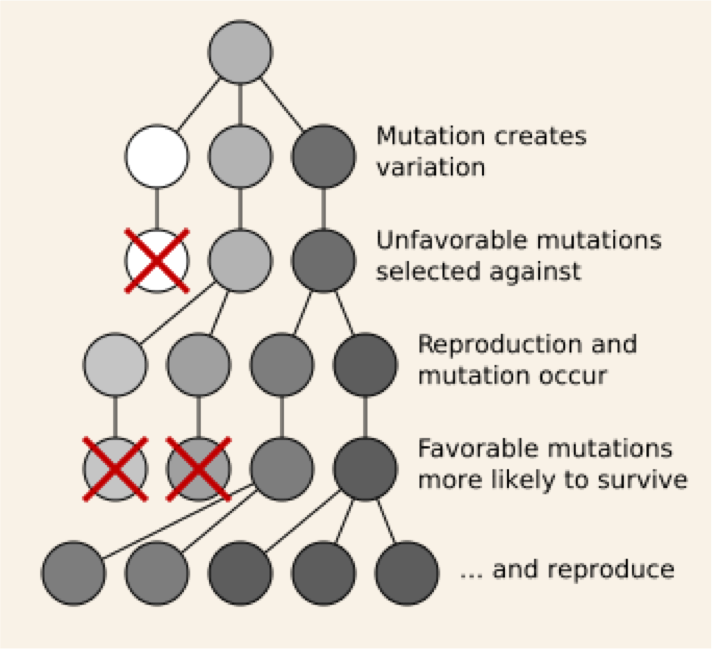
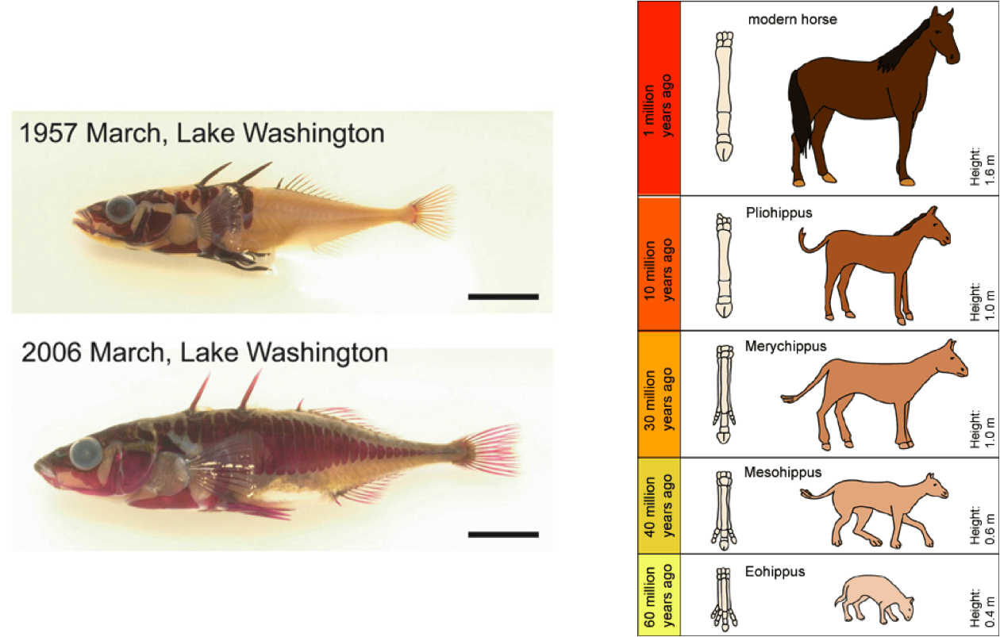
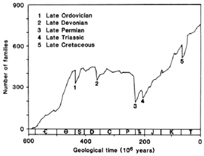
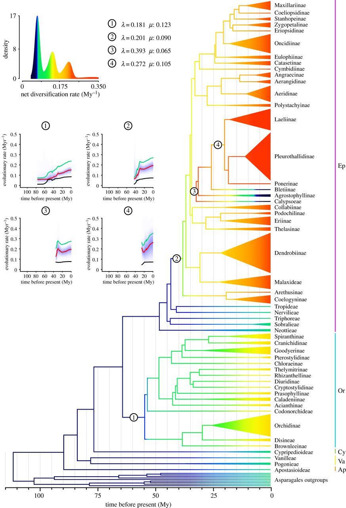
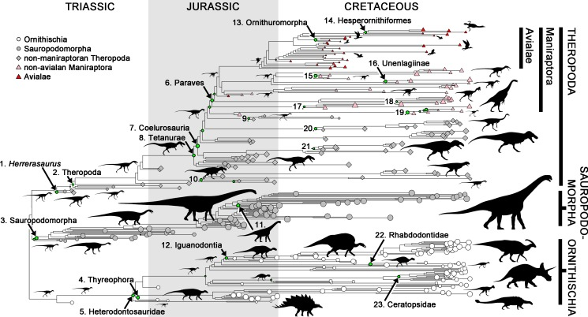
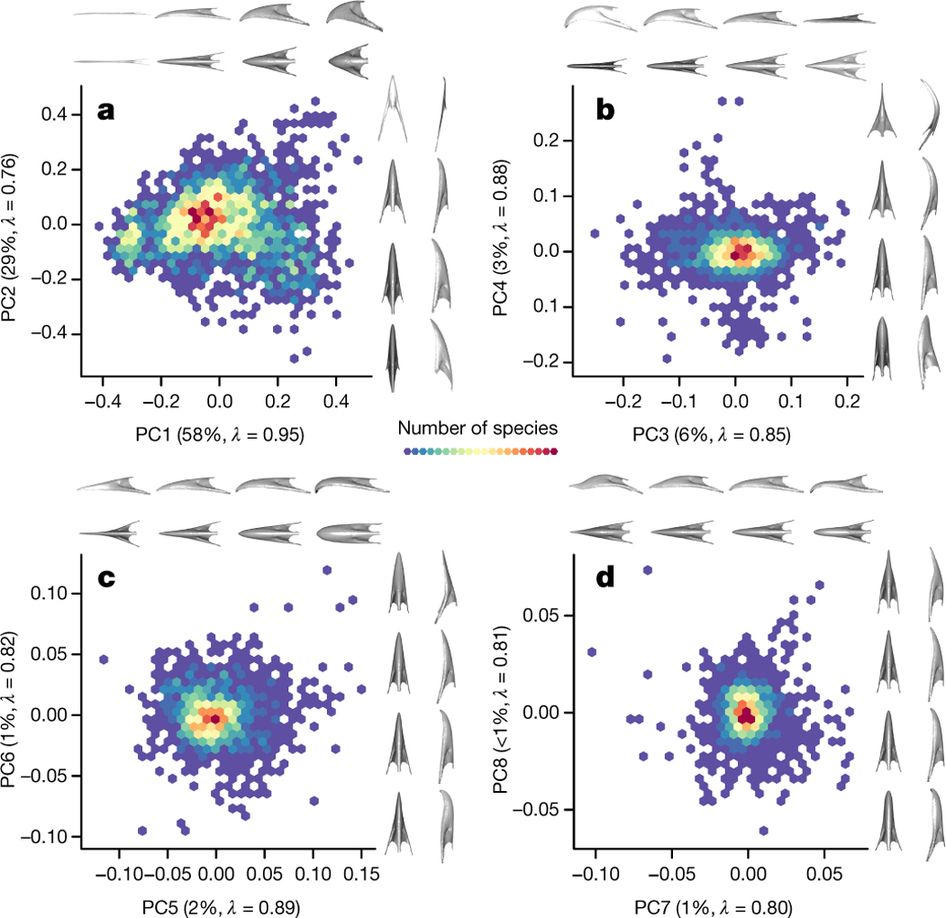
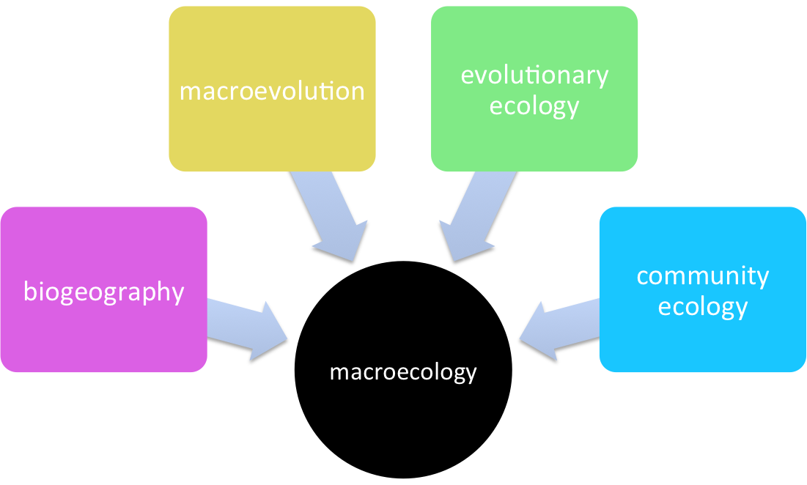

```{r setup, include=FALSE}
knitr::opts_chunk$set(echo = FALSE)
```

# What is microevolution?

### Evolution within a population of one species

[//]: #

# What is microevolution?

### Evolution within a population of one species


- Mutation
- Natural selection
- Gene Flow
- Genetic drift

[//]: #

# What is macroevolution?

### Evolution at the species-level and above

[//]: #

# What is macroevolution?

### Evolution at the species-level and above

- Speciation
- Extinction (including mass extinctions)
- Diversification (Speciation – Extinction)
- Changes in biodiversity through time
- Palaeontology and Neontology

[//]: #

# What is macroevolution?

### Evolution at large scales

- large temporal scale (deep-time)
- large numbers of species (broad taxonomic scale)
- large spatial scale (often)
- no clear definition of what scale defines macro vs. micro

[//]: #

# Links between micro- and macro-evolution

- Still being debated by biologists
- Therefore it is often brought up by creationists to prove that evolution is nonsense.
- There are two main schools of thought...

[//]: #

# Links between micro and macro evolution

### Macroevolution is repeated rounds of microevolution

- The only major difference is SCALE 
        - i.e. number of species, time scales
- Basic evolutionary mechanisms (mutation, migration, genetic drift and natural selection) can produce major evolutionary changes given enough time.
- For example, just two selective deaths per million individuals can cause evolution by natural selection (*Lande 1976*). 

[//]: #

# Links between micro and macro evolution

### Macroevolution is more than microevolution (*Erwin 2000*)

- Patterns/processes appear to be scale dependent
- Other drivers are involved 
    + climate change
    + plate tectonics
    + Earth axial rotation shifts etc.
        
- Some argue these affect micro-processes
- Others argue that **fundamentally different processes** act at different scales
- Do **species** under go selection? (*Jablonksi 2008; Okasha 2006*)

[//]: #

# Links between micro and macro evolution

- rates of evolution definitely differ... (*Jones et al 2012*; *Haldane 1949*)

<center></center>

[//]: #

# How do we study macroevolution?

- Using fossils (*Paul Barratt*, *Adrian Lister*)
    + extinct species mainly, but some subfossil work
- Using phylogenies (*many people in the Museum*)
    + extant species mainly
    + fossils used to date trees
    + Total Evidence phylogenies slowly becoming more popular
- Other evidence
    + Development (*Arkhat Azbanhov*)
    + Genes, genomes etc. (*Jeff Streicher*)
    + Ancient DNA (*Ian Barnes*)
    + Biogeography (*Dave Gower*)

[//]: #

# How do we study macroevolution?

- Fieldwork to collect fossils
- Databases of fossil occurence, e.g. PBDB (*Friday*)
- Phylogenetic comparative methods (*Monday, Wednesday*)
- Geometric morphometrics (*Tuesday*)
- Models, simulations etc.

[//]: #

# What do we study in macroevolution?

- Speciation & Extinction (including mass extinctions)
- Diversification (= Speciation – Extinction)
- Patterns in biodiversity through time
- Adaptive radiations
- Convergent and divergent evolution
- Tempo and mode of trait evolution
- Developmental controls on evolution
- Genome evolution

[//]: #

# What do we study in macroevolution?

- Mass extinctions & biodiversity through time (*Friday*; *Raup 1982 and Sepkoski*)

<center></center>

[//]: #

# What do we study in macroevolution?

- Diversification (*Wednesday*; *Givnish et al 2015*)

<center></center>

[//]: #

# What do we study in macroevolution?

- Tempo and mode of trait evolution (*Monday*; *Benson et al. 2014*)

<center></center>

[//]: #

# What do we study in macroevolution?

- Morphological (size and shape) evolution (*Tuesday*; *Cooney et al. 2017*)

<center></center>

[//]: #

# Modern macroevolution

- Big data, big analyses, complex methods
- Links between palaeo and living data/researchers (*Fritz et al 2013*)
- Total Evidence Phylogenies 
- Museums are *the* place to be for this kind of work

[//]: #

# Links with macroecology

<center></center>

# Links with macroecology

- often hard to tell the difference
- same processes, different patterns (?)
- similar methods and challenges
- both benefit from using living and fossil data

# Interested in learning more?

- Twitter: @BESMacroecol
- Conference @ NHM 5-7th July
- Macro ecology/evolution, paleo and living data