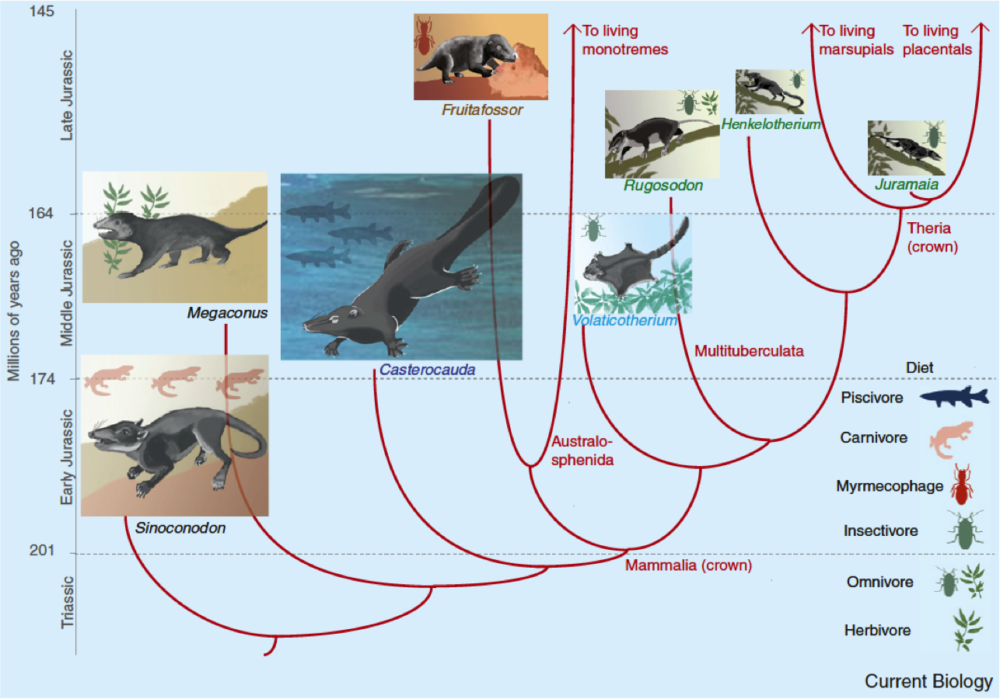
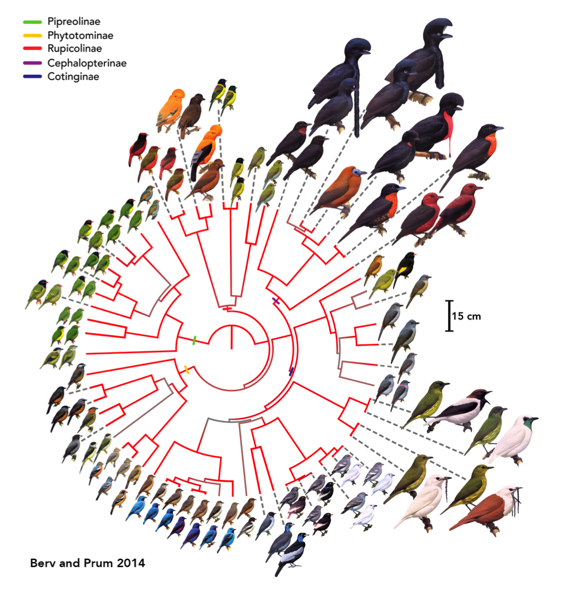

```{r setup, include=FALSE}
knitr::opts_chunk$set(echo = FALSE)
```

# What is microevolution?

Microevolution is evolution within a population of one species

# What is microevolution?

Microevolution is evolution within a population of one species
- Mutation
- Natural selection
- Gene Flow
- Genetic drift


# What is macroevolution?

Macroevolution is evolution at the species-level and above

# What is macroevolution?

Macroevolution is evolution at the species-level and above

- Speciation
- Extinction (including mass extinctions)
- Diversification (= Speciation – Extinction)
- Patterns in biodiversity through time (Talks later today)
- Adaptive radiations
- Convergent and divergent evolution
- Tempo and mode of trait evolution

# What is macroevolution?

Macroevolution is evolution at large temporal scale (deep-time)
- like macroecology no-one is sure what scale = macro vs. micro

# Links between micro and macro evolution

- This is a fun debate topic.
- Often brought up by creationists!
- Two schools of thought...
- Like macroecology, pattern and process vary with scale.

# Links between micro and macro evolution

1. Macroevolution = repeated rounds of microevolution
- The only major difference is SCALE 
        - i.e. number of species time scales
- Basic evolutionary mechanisms (mutation, migration, genetic drift and natural selection) can produce major evolutionary changes given enough time.
- For example, just two selective deaths per million individuals can cause evolution by natural selection (Lande 1976). 

# Links between micro and macro evolution

2. Macroevolution = more than microevolution
- Other drivers are involved 
        - climate change
        - plate tectonics
        - Earth axial rotation shifts etc.
- Some argue these things affect micro-processes
- Others argue that fundamentally different processes act at higher levels
- Like macroecology, processes are scale dependent
- Species selection (a dirty word in Europe!)

# Links between micro and macro evolution

- rates of evolution definitely differ...

<center></center>

# What do we study in macroevolution?

So much stuff!!!

- Speciation
- Extinction (including mass extinctions)
- Diversification (= Speciation – Extinction)
- Patterns in biodiversity through time
- Adaptive radiations
- Convergent and divergent evolution
- Tempo and mode of trait evolution

# How do we study macroevolution?

- Geometric morphometrics
- Phylogenetic comparative methods
- Biogeographic models
- Fossils, fieldwork etc.


# Modern macroevolution

- Big data, big analyses, complex methods
- Links between palaeo and living data/researchers
- Museums are *the* place to be for this kind of work
- Total Evidence Phylogenies 


# {.cover}



# {.cover}



# Links with macroecology

