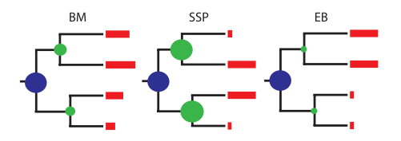

```{r setup, include=FALSE}
knitr::opts_chunk$set(echo = FALSE)
```

# What are the tempo and mode of evolution?

- tempo = speed or rate of evolution
- mode = how evolution happens

[//]: #

# Tempo/rates of evolution

1. Only considering the phylogeny/species (*Tuesday*)
    + speciation rates
    + extinction rates
    + diversification rates

2. Considering the traits of the species
    + rates of trait evolution
    
# Models of evolution

1. Only considering the phylogeny/species
    + gradual evolution (*Darwin*)
    + punctuated equilibrium (*Eldredge & Gould 1979*)
    + diversity dependence (*Rabosky*)

2. Considering the traits of the species
    + models of trait evolution
    + Brownian motion, Ornstein Uhlenbeck, Early Burst etc.
    + Mk models

# Models of continuous trait evolution - BM

- Brownian motion model
- Trait $X$ evolves at random at a rate $\sigma$:

$dX(t) = \sigma dW(t)$

- $W(t)$ is a white noise function
    + random variate drawn from a normal distribution
    + mean = 0
    + variance = $\sigma^2$. 

# Models of continuous trait evolution - BM

- assumes no overall drift in the direction of evolution 
- assumes rate of evolution is constant
- often called a random walk
- close relatives will be more similar in their trait values than more distant relatives.
- variance in the trait will increase (linearly) in proportion to time.

# Models of continuous trait evolution - OU

- Ornstein-Uhlenbeck model
- random walk where trait values are pulled back an “optimal” value 

$dX(t) = -\alpha(X(t) - \mu) + \sigma dW(t)$

- $\mu$ is a long-term mean species evolve around
- $\alpha$ is the strength of evolutionary force that returns traits back towards the long-term mean 
    + “rubber band” parameter 
    + if $\alpha$ is zero then evolution is Brownian.

# Models of continuous trait evolution - BM and OU

<center></center>

# Models of continuous trait evolution - EB

- Early Burst model 
- random walk model where the rate of evolution decreases exponentially through time

$r(t) = \sigma^2e(at)$

- $r(t)$ is the rate of evolution at time $t$, 
- $\sigma^2$ is the initial rate of evolution
- $a$ is the rate change parameter ($<=0$)
. 
    + if $a$ is negative, rates of evolution decrease through time 
    + $a$ is zero then evolution is Brownian

# Models of continuous trait evolution

- SSP = OU with one optimum, it can have many.

<center></center>

# Model selection - AIC

- is everyone happy with AIC?

# Models of discrete trait evolution

```{r, echo = FALSE, message = FALSE, fig.width=6, fig.height=3, fig.align = 'center'}
library(ape)
data(bird.orders)
x <- factor(c(rep(0, 5), rep(1, 18)))
ans <- ace(x, bird.orders, type = "d")
par(mar = c(0,0,0,0))
plot(bird.orders, type = "c", FALSE, label.offset = 1, cex = 0.8)
co <- c("blue", "yellow")
tiplabels(pch = 21, bg = co[as.numeric(x)], cex = 2, adj = 1)
nodelabels(pie = ans$lik.anc, piecol = co, cex = 0.75)
```

# Models of discrete trait evolution - ER

- Mk1 – all rates equal (ER)
    + M for Markov
    + k1 for $k = 1$ or 1 parameter. 
- single transition rate (Q rate matrix). 

-|A|B|C
--|--|--|--
A|-|1|1
B|1|-|1
C|1|1|-

- **Jukes-Cantor model**

# Models of discrete trait evolution - SYM

- Mk – symmetric rates (SYM)

-|A|B|C
--|--|--|--
A|-|1|2
B|1|-|3
C|2|3|-

- rate of change is the same regardless of direction
- rate of change differs among states
- **6-rate GTR (General Time Reversible) model**
- a symmetric model with only 2 states = equal rates (Mk1) model.

# Models of discrete trait evolution - ARD

- All rates different model (ARD)

-|A|B|C
--|--|--|--
A|-|1|2
B|3|-|4
C|5|6|-

- rate of change differs among states and directions
- good if you assume states are not reversible
- good for large complex datasets
- beware of over-fitting

# Practical - Macroevolutionary models in R

- split into two practicals - continuous and discrete traits
- may be more detail than you need, we'll see how we get on
- make sure to read the notes carefully
- feel free to discuss with colleagues
- ask if you get stuck or have questions
- take breaks when you like
- Remember to answer the practice questions (on the discrete practical file) and SAVE YOUR RESULTS AND CODE.
