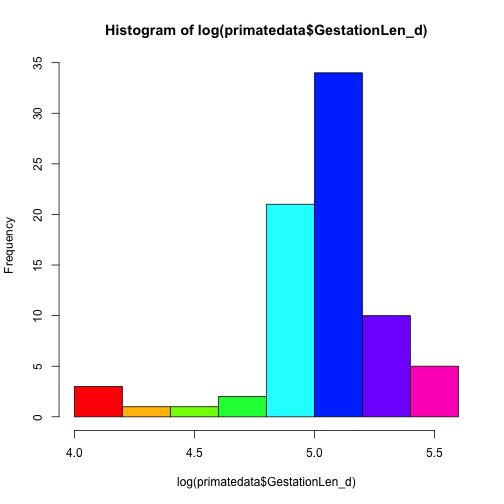

```r
install.packages("ape")
```


```r
library(ape)
```


```r
primatedata <- read.table("Primatedata.txt", sep = "\t", header = TRUE)
```


```r
str(primatedata)
```

```
## 'data.frame':	77 obs. of  8 variables:
##  $ Order          : Factor w/ 1 level "Primates": 1 1 1 1 1 1 1 1 1 1 ...
##  $ Family         : Factor w/ 15 levels "Aotidae","Atelidae",..: 2 2 2 14 3 3 3 4 4 4 ...
##  $ Binomial       : Factor w/ 77 levels "Alouatta palliata",..: 5 6 7 8 9 10 11 15 16 17 ...
##  $ AdultBodyMass_g: num  6692 7582 8697 958 558 ...
##  $ GestationLen_d : num  138 226 228 164 154 ...
##  $ HomeRange_km2  : num  2.28 0.73 1.36 0.02 0.32 0.02 0.00212 0.51 0.16 0.24 ...
##  $ MaxLongevity_m : num  336 328 454 304 215 ...
##  $ SocialGroupSize: num  14.5 42 20 2.95 6.85 ...
```


```r
head(primatedata)
```

```
##      Order      Family           Binomial AdultBodyMass_g GestationLen_d
## 1 Primates    Atelidae   Ateles belzebuth          6692.4          138.2
## 2 Primates    Atelidae   Ateles geoffroyi          7582.4          226.4
## 3 Primates    Atelidae    Ateles paniscus          8697.2          228.2
## 4 Primates Pitheciidae  Callicebus moloch           958.1          164.0
## 5 Primates     Cebidae  Callimico goeldii           558.0          154.0
## 6 Primates     Cebidae Callithrix jacchus           290.2          144.0
##   HomeRange_km2 MaxLongevity_m SocialGroupSize
## 1          2.28          336.0           14.50
## 2          0.73          327.6           42.00
## 3          1.36          453.6           20.00
## 4          0.02          303.6            2.95
## 5          0.32          214.8            6.85
## 6          0.02          201.6            8.55
```


```r
names(primatedata)
```

```
## [1] "Order"           "Family"          "Binomial"        "AdultBodyMass_g"
## [5] "GestationLen_d"  "HomeRange_km2"   "MaxLongevity_m"  "SocialGroupSize"
```

This gives you the names of the columns.


```r
primatedata
```


```r
primatetree <- read.nexus("consensusTree_10kTrees_Version2.nex")
```

```
## Error: could not find function "read.nexus"
```


Let’s examine the tree by typing:


```r
primatetree
```

```
## Error: object 'primatetree' not found
```

```r
str(primatetree)
```

```
## Error: object 'primatetree' not found
```


```r
plot(primatetree)
```


```r
plot(primatetree, cex = 0.5)
```


```r
zoom(primatetree, list(grep("Cercopithecus", primatetree$tip.label)), subtree = FALSE)
```


```r
zoom(primatetree, list(grep("Cercopithecus", primatetree$tip.label)), subtree = TRUE)
```


```r
primatetree2 <- drop.tip(primatetree, "Aotus_azarae_infulatus")
```

```
## Error: could not find function "drop.tip"
```

```r
str(primatetree2)
```

```
## Error: object 'primatetree2' not found
```


```r
`?`(plot.phylo)
```


```r
par(mfrow = c(1, 1))
plot(primatetree, type = "fan", edge.color = "deeppink", tip.color = "green", 
    cex = 0.5)
```


```r
plot(primatetree)
axisPhylo()
```


```r
is.binary.tree(primatetree)  # we want this to be TRUE
```

```
## Error: could not find function "is.binary.tree"
```

```r
primatetree <- multi2di(primatetree)
```

```
## Error: could not find function "multi2di"
```


```r
primatetree.reroot <- root(primatetree, "Saimiri_sciureus")
plot(primatetree.reroot)
```


```r
primatedata$Binomial <- gsub(" ", "_", primatedata$Binomial)
```


```r
row.names(primatedata) <- primatedata$Binomial
```

```r
par(mfrow = c(2, 2))
```


```r
hist(primatedata$AdultBodyMass_g)
hist(primatedata$GestationLen_d)
```


```r
hist(log(primatedata$AdultBodyMass_g))
hist(log(primatedata$GestationLen_d))
```


```r
hist(log(primatedata$GestationLen_d), col = rainbow(8))
```

 


```r
par(mfrow = c(1, 1))
```


```r
model.ols <- lm(log(GestationLen_d) ~ log(AdultBodyMass_g), data = primatedata)
summary(model.ols)
```

```
## 
## Call:
## lm(formula = log(GestationLen_d) ~ log(AdultBodyMass_g), data = primatedata)
## 
## Residuals:
##     Min      1Q  Median      3Q     Max 
## -0.6161 -0.0828  0.0065  0.1141  0.5056 
## 
## Coefficients:
##                      Estimate Std. Error t value Pr(>|t|)    
## (Intercept)            4.1038     0.1108   37.04  < 2e-16 ***
## log(AdultBodyMass_g)   0.1204     0.0141    8.54  1.1e-12 ***
## ---
## Signif. codes:  0 '***' 0.001 '**' 0.01 '*' 0.05 '.' 0.1 ' ' 1
## 
## Residual standard error: 0.198 on 75 degrees of freedom
## Multiple R-squared:  0.493,	Adjusted R-squared:  0.487 
## F-statistic:   73 on 1 and 75 DF,  p-value: 1.1e-12
```


```r
plot(log(GestationLen_d) ~ log(AdultBodyMass_g), data = primatedata)
abline(model.ols)
```


```r
points(log(GestationLen_d[Family == "Cercopithecidae"]) ~ log(AdultBodyMass_g[Family == 
    "Cercopithecidae"]), data = primatedata, col = "blue", pch = 16)
```


```r
primate <- comparative.data(phy = primatetree, data = primatedata, names.col = Binomial, 
    vcv = TRUE, na.omit = FALSE, warn.dropped = TRUE)
```

```
## Error: could not find function "comparative.data"
```


```r
primate$dropped$tips
```

```
## Error: object 'primate' not found
```

```r
primate$dropped$unmatched.rows
```

```
## Error: object 'primate' not found
```


```r
model.pgls <- pgls(log(GestationLen_d) ~ log(AdultBodyMass_g), data = primate, 
    lambda = "ML")
```

```
## Error: could not find function "pgls"
```

```r
summary(model.pgls)
```

```
## Error: object 'model.pgls' not found
```


```r
plot(log(GestationLen_d) ~ log(AdultBodyMass_g), data = primate$data)
abline(model.pgls)
```


```r
model.pgls2 <- pgls(log(GestationLen_d) ~ log(AdultBodyMass_g), data = primate, 
    lambda = "ML", bounds = list(lambda = c(1e-06, 1)))
```

```
## Error: could not find function "pgls"
```

```r
summary(model.pgls2)
```

```
## Error: object 'model.pgls2' not found
```


```r
lambda.profile <- pgls.profile(model.pgls, "lambda")
plot(lambda.profile)
```


```r
pgls.confint(model.pgls, "lambda")
```

```
## Error: could not find function "pgls.confint"
```


```r
est.lambda <- pgls(log(GestationLen_d) ~ 1, data = primate, lambda = "ML")
```

```
## Error: could not find function "pgls"
```

```r
summary(est.lambda)
```

```
## Error: object 'est.lambda' not found
```


```r
par(mfrow = c(2, 2))
plot(model.pgls)
```


```r
pgls.residuals <- residuals(model.pgls, phylo = TRUE)
```

```
## Error: object 'model.pgls' not found
```


```r
std.residuals <- pgls.residuals/sqrt(var(pgls.residuals))[1]
```

```
## Error: object 'pgls.residuals' not found
```


```r
rownames(std.residuals) <- rownames(model.pgls$residuals)
```

```
## Error: object 'model.pgls' not found
```


```r
rownames(std.residuals)[(abs(std.residuals) > 3)]
```

```
## Error: object 'std.residuals' not found
```


```r
primate.no.outliers <- primate[-which(abs(std.residuals) > 3), ]
```

```
## Error: object 'primate' not found
```


```r
model.pgls.no.outliers <- pgls(log(GestationLen_d) ~ log(AdultBodyMass_g), data = primate.no.outliers, 
    lambda = "ML")
```

```
## Error: could not find function "pgls"
```

```r
summary(model.pgls.no.outliers)
```

```
## Error: object 'model.pgls.no.outliers' not found
```


```r
par(mfrow = c(2, 2))
plot(model.pgls.no.outliers)
```


```r
lngest <- log(primatedata$GestationLen_d)
names(lngest) <- primatedata$Binomial
```


```r
Kcalc(lngest[primatetree$tip.label], primatetree)
```

```
## Error: could not find function "Kcalc"
```


```r
phylosignal(lngest[primatetree$tip.label], primatetree, reps = 1000)
```

```
## Error: could not find function "phylosignal"
```


```r
setdiff(primatetree$tip.label, primatedata$Binomial)
```

```
## Error: object 'primatetree' not found
```


```r
primatetree2 <- drop.tip(primatetree, setdiff(primatetree$tip.label, primatedata$Binomial))
```

```
## Error: could not find function "drop.tip"
```


```r
setdiff(primatedata$Binomial, primatetree$tip.label)
```

```
## Error: object 'primatetree' not found
```


```r
matches <- match(primatedata$Binomial, primatetree2$tip.label, nomatch = 0)
```

```
## Error: object 'primatetree2' not found
```

```r
primatedata2 <- subset(primatedata, matches != 0)
```

```
## Error: object 'matches' not found
```


```r
str(primatedata2)
```

```
## Error: object 'primatedata2' not found
```

```r
str(primatetree2)
```

```
## Error: object 'primatetree2' not found
```

